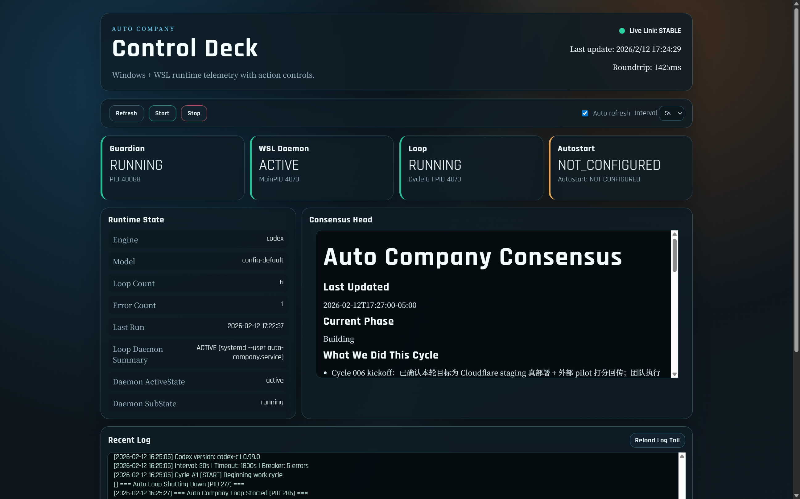

<div align="center">

# Auto Company

**全自主 AI 公司，24/7 不停歇运行** <a href="README.md"></a>

基于 **Agentic Workflows (代理式工作流)** 驱动，系统编排了 14 个 **Autonomous AI Agent (自主智能体)**，每个都是该领域世界顶级专家的思维分身。
自主构思产品、做决策、写代码、部署上线、搞营销。没有人类参与。

默认使用 Claude Code，并支持 [Codex CLI](https://www.npmjs.com/package/@openai/codex)（macOS 原生 + Windows/WSL），两端都可启动本地 Dashboard。

[](#依赖)
[](#windows-wsl-快速开始)
[![Codex CLI](https://img.shields.io/badge/驱动-Codex%20CLI-orange?logo=data:image/svg%2Bxml;base64,PHN2ZyB2aWV3Qm94PSIwIDAgMjQgMjQiIHhtbG5zPSJodHRwOi8vd3d3LnczLm9yZy8yMDAwL3N2ZyIgZmlsbD0id2hpdGUiPjxwYXRoIGQ9Ik0yMi4yODE5IDkuODIxMWE1Ljk4NDcgNS45ODQ3IDAgMCAwLS41MTU3LTQuOTEwOCA2LjA0NjIgNi4wNDYyIDAgMCAwLTYuNTA5OC0yLjlBNi4wNjUxIDYuMDY1MSAwIDAgMCA0Ljk4MDcgNC4xODE4YTUuOTg0NyA1Ljk4NDcgMCAwIDAtMy45OTc3IDIuOSA2LjA0NjIgNi4wNDYyIDAgMCAwIC43NDI3IDcuMDk2NiA1Ljk4IDUuOTggMCAwIDAgLjUxMSA0LjkxMDcgNi4wNTEgNi4wNTEgMCAwIDAgNi41MTQ2IDIuOTAwMUE2LjA2NTEgNi4wNjUxIDAgMCAwIDE5LjAyIDE5LjgxODJhNS45ODQ3IDUuOTg0NyAwIDAgMCAzLjk5NzctMi45MDAxIDYuMDQ2MiA2LjA0NjIgMCAwIDAtLjczNTgtNy4wOTdaTTguNzQ5IDYuNzU3OGE0LjQxMTggNC40MTE4IDAgMCAxIDcuMzY3MyAxLjE0NDQgNC4zOTg2IDQuMzk4NiAwIDAgMS0uMjkyOCA0LjIyODVsLTQuNzA3LTIuNzIxNHYtMi42NTE1Wk02LjUzMzIgMTQuNjU0YTQuNDExOCA0LjQxMTggMCAwIDEtMS4xMjkzLTcuMzcgNC4zOTg2IDQuMzk4NiAwIDAgMSA0LjEzNTItMS4zOWwyLjM2MTUgNC4wOTN2NS4zMDJMNi41MzMyIDE0LjY1NFptLTEuODQ4LTEuNTcyYTQuNDExOCA0LjQxMTggMCAwIDEgNi4yMzgtNi4yMjYgNC4zOTg2IDQuMzk4NiAwIDAgMSAzLjg0MzMgMi44MzhsLTQuNzA3IDIuNzIxdjUuMzAxNUw0LjY4NTIgMTMuMDgyWm0xMC41NjU4IDQuMTZhNC40MTE4IDQuNDExOCAwIDAgMS03LjM2NzMtMS4xNDQzIDQuMzk4NiA0LjM5ODYgMCAwIDEgLjI5MjgtNC4yMjg1bDQuNzA3IDIuNzIxNHYyLjY1MTRabTIuMjE1OC03Ljg5NmE0LjQxMTggNC40MTE4IDAgMCAxIDEuMTI5MyA3LjM3IDQuMzk4NiA0LjM5ODYgMCAwIDEtNC4xMzUyIDEuMzlsLTIuMzYxNS00LjA5M1Y5LjE4Nmw1LjM2NzQgMi4xODZabTEuODQ4IDEuNTcyYTQuNDExOCA0LjQxMTggMCAwIDEtNi4yMzggNi4yMjYgNC4zOTg2IDQuMzk4NiAwIDAgMS0zLjg0MzMtMi44MzhsNC43MDctMi43MjFWOS4xODZsNS4zNzQgMy4wOTZaTTEyIDE2LjUxNmE0LjQxMTggNC40MTE4IDAgMCAxLTQuNDExOC00LjQxMThjMC0yLjQzNDggMS45NzctNC40MTE4IDQuNDExOC00LjQxMThzNC40MTE4IDEuOTc3IDQuNDExOCA0LjQxMTgtMS45NzcgNC40MTE4LTQuNDExOCA0LjQxMThaIi8+PC9zdmc+&logoColor=white)](https://www.npmjs.com/package/@openai/codex)
[](#依赖)
[](https://opensource.org/licenses/MIT)

</div>

---

## 看板预览



## 这是什么？

你启动一个循环。AI 团队醒来，读取共识记忆，决定干什么，组建 3-5 人小队，执行任务，更新共识记忆，然后睡一觉。接着又醒来。如此往复，永不停歇。

```
daemon (launchd / systemd --user, 崩溃自重启)
  └── scripts/core/auto-loop.sh (永续循环)
        ├── 读 PROMPT.md + consensus.md
        ├── CLI 调用（Codex CLI / Claude Code）
        │   ├── 读 CLAUDE.md (公司章程 + 安全红线)
        │   ├── 读 .claude/skills/team/SKILL.md (组队方法)
        │   ├── 组建 Agent Team (3-5 人)
        │   ├── 执行：调研、写码、部署、营销
        │   └── 更新 memories/consensus.md (传递接力棒)
        ├── 失败处理: 限额等待 / 熔断保护 / consensus 回滚
        └── sleep → 下一轮
```

每个周期是一次独立的 CLI 调用。`memories/consensus.md` 是唯一的跨周期状态——类似接力赛传棒。

## 你该看哪一节（按平台）

- Windows 用户：从 [Windows (WSL) 快速开始](#windows-wsl-快速开始) 开始，再看 [`docs/windows-setup.md`](docs/windows-setup.md)
- macOS 用户：从 [macOS 快速开始](#macos-快速开始) 开始，再看 [命令速查（按平台）](#命令速查按平台)

## 团队阵容（14 人）

不是"你是一个开发者"，而是"你是 DHH"——用真实传奇人物激活 LLM 的深层知识。

| 层级 | 角色 | 专家 | 核心能力 |
|------|------|------|----------|
| **战略** | CEO | Jeff Bezos | PR/FAQ、飞轮效应、Day 1 心态 |
| | CTO | Werner Vogels | 为失败而设计、API First |
| | 逆向思考 | Charlie Munger | 逆向思维、Pre-Mortem、心理误判清单 |
| **产品** | 产品设计 | Don Norman | 可供性、心智模型、以人为本 |
| | UI 设计 | Matías Duarte | Material 隐喻、Typography 优先 |
| | 交互设计 | Alan Cooper | Goal-Directed Design、Persona 驱动 |
| **工程** | 全栈开发 | DHH | 约定优于配置、Majestic Monolith |
| | QA | James Bach | 探索性测试、Testing ≠ Checking |
| | DevOps/SRE | Kelsey Hightower | Serverless 优先、自动化一切 |
| **商业** | 营销 | Seth Godin | 紫牛、许可营销、最小可行受众 |
| | 运营 | Paul Graham | Do Things That Don't Scale、拉面盈利 |
| | 销售 | Aaron Ross | 可预测收入、漏斗思维 |
| | CFO | Patrick Campbell | 基于价值定价、单位经济学 |
| **情报** | 调研分析 | Ben Thompson | Aggregation Theory、价值链分析 |

另配 **30+ 技能**（深度调研、网页抓取、财务建模、SEO、安全审计、UX 审计……），任何 Agent 按需取用。

## macOS 快速开始

```bash
# 前提:
# - macOS
# - 已安装并登录 Codex CLI 或 Claude Code
# - 可用模型配额

# 克隆
git clone https://github.com/MaxMiksa/Auto-Company.git
cd auto-company

# 前台运行（直接看输出）
make start

# 或安装为守护进程（开机自启 + 崩溃自重启）
make install
```

## Windows (WSL) 快速开始

```powershell
# 前提:
# - Windows 10/11 + WSL2 (Ubuntu)
# - 已在 WSL 内安装并登录 Codex CLI 或 Claude Code
# - WSL 内已可用 jq 和 make
# - 可用模型配额

# 克隆
git clone https://github.com/MaxMiksa/Auto-Company.git
cd auto-company

# 在 PowerShell 启动（守护模式，默认引擎为 claude）
.\scripts\windows\start-win.ps1

# 显式切换引擎
.\scripts\windows\start-win.ps1 -Engine codex

# 查看状态
.\scripts\windows\status-win.ps1

# 停止
.\scripts\windows\stop-win.ps1
```

监控、看板、自启等命令请查看 [`docs/windows-setup.md`](docs/windows-setup.md)。


## 命令速查（按平台）

| 任务 | macOS / WSL（在终端执行） | Windows（在 PowerShell 执行） |
|---|---|---|
| 启动 | `make start` | `.\scripts\windows\start-win.ps1` |
| 查看状态 | `make status` | `.\scripts\windows\status-win.ps1` |
| 实时日志 | `make monitor` | `.\scripts\windows\monitor-win.ps1` |
| 最近一轮输出 | `make last` | `.\scripts\windows\last-win.ps1` |
| 周期摘要 | `make cycles` | `.\scripts\windows\cycles-win.ps1` |
| 停止 | `make stop` | `.\scripts\windows\stop-win.ps1` |
| 可视化看板 | `make dashboard` | `.\scripts\windows\dashboard-win.ps1` |
| 安装守护 | `make install` | 由 `start-win.ps1` 自动安装/启动 WSL daemon |
| 卸载守护 | `make uninstall` | `wsl -d Ubuntu --cd <repo_wsl_path> bash -lc 'make uninstall'` |
| 暂停守护 | `make pause` | `wsl -d Ubuntu --cd <repo_wsl_path> bash -lc 'make pause'` |
| 恢复守护 | `make resume` | `wsl -d Ubuntu --cd <repo_wsl_path> bash -lc 'make resume'` |

### macOS 防睡眠（仅 macOS）

macOS 的屏保/锁屏通常不会杀进程，但系统睡眠会让任务暂停。长时间运行建议开启：

```bash
make start-awake   # 启动循环并保持系统唤醒（直到循环退出）

# 如果循环已经在跑（比如你已执行 make start）：
make awake         # 读取 .auto-loop.pid 并对该 PID 挂 caffeinate
```

说明：
- 这两个命令依赖 macOS 自带 `caffeinate`
- `make awake` 会在 PID 结束后自动退出

## 架构技术介绍详单 (5-Layer Architecture)

Auto-Company 并非简单调用 LLM API，而是一个高度解耦的 **多智能体系统 (Multi-Agent System, MAS)**。其技术架构分为 5 个清晰的层级：

```text
┌────────────────────────────────────────────────────────────┐
│ 5. 监控与人机交互层 (Observability & HITL)                 │
│    [ Dashboard看板 ]  [ 基于文件的操纵杆 (consensus.md) ]  │
├────────────────────────────────────────────────────────────┤
│ 4. 工作流路由层 (Workflow Routing & Teaming)               │
│    [ 动态组队路由 (Squad) ]  [ 强制收敛流 (Cycle 1->2->3) ]│
├────────────────────────────────────────────────────────────┤
│ 3. 智能体模型与认知层 (Agentic Models & Cognition)         │
│    [ 14 个专家人格 (Personas) ]  [ 30+ 技能库 (Skills) ]   │
├────────────────────────────────────────────────────────────┤
│ 2. 编排与状态控制层 (Orchestration & State Machine)        │
│    [ 永续主循环 ]  [ 状态机 (Consensus) ]  [ 容错与熔断 ]  │
├────────────────────────────────────────────────────────────┤
│ 1. 基础设施与执行引擎层 (Execution Engine & Infrastructure)│
│    [ 双核驱动器 (Claude/Codex) ]  [ 跨平台守护进程 (Daemon)]│
└────────────────────────────────────────────────────────────┘
```

### 第 5 层：监控与人机交互层 (Observability & HITL)
*   **基于文件的操纵杆 (File-based Steering)**：人类只需编辑 `memories/consensus.md`，修改 `Next Action`，下一个周期醒来的 AI 团队就会立刻“转舵”，实现极简的宏观控制。
*   **全链路日志与看板 (Dashboard)**：`logs/` 记录每一轮的完整输出和思考链；`dashboard/` 提供基于 Python Server 的本地可视化看板，实时展现 Cycle 状态、成本消耗和 Agent 活跃度。

### 第 4 层：工作流路由层 (Workflow Routing & Teaming)
*   **动态组队路由 (Dynamic Squad Formation)**：系统利用 Agent Teams 功能，根据当前 `consensus.md` 中的 "Next Action"，从 14 人池子中动态挑选 2-5 名最适合的专家，并在当前循环中将它们“实例化”为子代理。
*   **强制收敛流 (Convergence Workflow)**：由 `PROMPT.md` 强制执行的流程控制。例如：Cycle 1 发散（提 Idea） -> Cycle 2 验证（算账预检，输出 GO/NO-GO） -> Cycle 3 执行（写代码部署，**禁止纯讨论**）。

### 第 3 层：智能体模型与认知层 (Agentic Models & Cognition)
*   **专家思维注入 (Expert Personas)**：在 `.claude/agents/` 下，注入具体的历史人物/行业领袖思维模型框架（如 Bezos 的“逆向工作法”、Munger 的“查理清单”、DHH 的“宏伟单体架构”），使决策具有极高的商业和工程厚度。
*   **技能库系统 (Skill Arsenal)**：位于 `.claude/skills/` 的可插拔插件系统（如 `frontend-design`, `security-audit`）。将具体方法论封装成工具，供任何被唤醒的 Agent “临时加载”。
*   **约束与红线 (Constitutional Guardrails)**：写死在 `CLAUDE.md` 中的系统级 Prompt，设定了绝对不能触碰的底线（如禁止删除仓库、强制推送），确保高度自治下的安全性。

### 第 2 层：编排与状态控制层 (Orchestration & State Machine)
*   **永续主循环 (The Auto-Loop)**：通过 `scripts/core/auto-loop.sh` 控制的执行循环，让 AI 摆脱“单次对话”，实现 24/7 永续运行。
*   **轻量级状态机 (Consensus Memory)**：放弃复杂的向量数据库或内存管理，将跨周期的上下文压缩为一个 Markdown 文件：`memories/consensus.md`。每次循环开始前读取，结束前必须重写，作为整个系统的“接力棒”。
*   **高可用容错机制 (Resilience & Self-Healing)**：内置熔断器 (连续错误触发冷却)、限流退避 (429 报错自动休眠) 和沙箱重置 (未成功输出有效共识时自动回滚)。

### 第 1 层：基础设施与执行引擎层 (Execution Engine & Infrastructure)
*   **双核驱动器 (Dual-Engine Executor)**：通过调用成熟的 AI 命令行工具 **Claude Code** 或 **Codex CLI** 作为底层执行器，天然继承其文件读写、Bash 执行、Git 操作等能力。
*   **跨平台守护进程 (Cross-Platform Daemon)**：macOS 基于 `launchd` 实现开机自启和崩溃重启；Windows/WSL 基于 `systemd --user` 在 WSL 容器内运行，外部通过 PowerShell 进行控制和保活。
*   **沙盒边界 (Sandbox Boundary)**：目前依赖底层 CLI 的配置（如 Codex 的 `danger-full-access` 或 Claude 的 `bypassPermissions`），系统级操作均在宿主机环境（或 WSL 容器）中直接发生。

## 运作机制

### 自动收敛（防止无限讨论）

| 周期 | 动作 |
|------|------|
| Cycle 1 | 头脑风暴——每个 Agent 提一个想法，排出 top 3 |
| Cycle 2 | 验证 #1——Munger 做 Pre-Mortem，Thompson 验证市场，Campbell 算账 → **GO / NO-GO** |
| Cycle 3+ | GO → 建 repo 写代码部署。NO-GO → 试下一个。**纯讨论禁止** |

### 六大标准流程

| # | 流程 | 协作链 |
|---|------|--------|
| 1 | **新产品评估** | 调研 → CEO → Munger → 产品 → CTO → CFO |
| 2 | **功能开发** | 交互 → UI → 全栈 → QA → DevOps |
| 3 | **产品发布** | QA → DevOps → 营销 → 销售 → 运营 → CEO |
| 4 | **定价变现** | 调研 → CFO → 销售 → Munger → CEO |
| 5 | **每周复盘** | 运营 → 销售 → CFO → QA → CEO |
| 6 | **机会发现** | 调研 → CEO → Munger → CFO |

## 引导方向

AI 团队全自主运行，但你可以随时介入：

| 方式 | 操作 |
|------|------|
| **改方向** | 修改 `memories/consensus.md` 的 "Next Action" |
| **暂停** | `make pause`（macOS/WSL 守护模式）或 `.\scripts\windows\stop-win.ps1`（Windows 入口） |
| **恢复** | `make resume`，回到自主模式 |
| **审查产出** | 查看 `docs/*/`——每个 Agent 的工作成果 |

## 安全红线

写死在 `CLAUDE.md`，对所有 Agent 强制生效：

- 不得删除 GitHub 仓库（`gh repo delete`）
- 不得删除 Cloudflare 项目（`wrangler delete`）
- 不得删除系统文件（`~/.ssh/`、`~/.config/` 等）
- 不得进行非法活动
- 不得泄露凭证到公开仓库
- 不得 force push 到 main/master
- 所有新项目必须在 `projects/` 目录下创建

## 配置

环境变量覆盖：

```bash
ENGINE=claude make start                   # 默认引擎（claude|codex）
ENGINE=codex make start                    # 切换到 codex
MODEL=sonnet make start                    # 可选：临时覆盖模型
CLAUDE_PERMISSION_MODE=bypassPermissions make start  # Claude 权限模式
LOOP_INTERVAL=60 make start                # 60 秒间隔（默认 30）
CYCLE_TIMEOUT_SECONDS=3600 make start      # 单轮超时 1 小时（默认 1800）
MAX_CONSECUTIVE_ERRORS=3 make start        # 熔断阈值（默认 5）
CODEX_SANDBOX_MODE=workspace-write make start  # 可选：覆盖 codex 沙箱模式
CLAUDE_BIN=/usr/local/bin/claude make start     # 可选：覆盖 Claude 可执行路径
CODEX_BIN=/usr/local/bin/codex make start       # 可选：覆盖 Codex 可执行路径
```

Windows `start-win.ps1` 会把同名配置写入 `.auto-loop.env`：

```powershell
.\scripts\windows\start-win.ps1 -Engine claude -ClaudePermissionMode bypassPermissions
.\scripts\windows\start-win.ps1 -Engine codex -SandboxMode workspace-write
# 兼容旧参数：
.\scripts\windows\start-win.ps1 -Engine codex -CodexSandboxMode workspace-write
```

不会自动进行引擎回退。所选引擎缺失时会直接启动失败。

## 项目结构

```
auto-company/
├── CLAUDE.md              # 公司章程（使命 + 安全红线 + 团队 + 流程）
├── PROMPT.md              # 每轮工作指令（收敛规则）
├── Makefile               # 常用命令
├── INDEX.md               # 脚本索引与职责表
├── dashboard/             # 本地 Web 状态看板（macOS 用 make dashboard，Windows 用 dashboard-win.ps1）
├── scripts/
│   ├── core/              # 主循环与核心控制实现（auto-loop/monitor/stop）
│   ├── windows/           # Windows 入口/守护/自启实现
│   ├── wsl/               # WSL systemd --user 守护实现
│   └── macos/             # macOS launchd 守护实现
├── memories/
│   └── consensus.md       # 共识记忆（跨周期接力棒）
├── docs/                  # Agent 产出（14 个目录 + Windows 指南）
├── projects/              # 所有新建项目的工作空间
├── logs/                  # 循环日志
└── .claude/
    ├── agents/            # 14 个 Agent 定义（专家人格）
    ├── skills/            # 30+ 技能（调研、财务、营销……）
    └── settings.json      # 权限 + Agent Teams 开关
```

## 依赖

| 依赖 | 说明 |
|------|------|
| **Claude Code / Codex CLI** | 支持的 CLI 引擎（默认 Claude） |
| **macOS 或 Windows + WSL2 (Ubuntu)** | macOS 支持 launchd；Windows 走 WSL 执行内核 |
| `node` | npm 安装 CLI 的运行时 |
| `make` | 启停与监控命令入口（WSL/macOS） |
| `jq` | 推荐，辅助处理日志 |
| `gh` | 可选，GitHub CLI |
| `wrangler` | 可选，Cloudflare CLI |

## 常见问题

### 1) WSL 跑 `.sh` 报 `^M` / `bad interpreter`

- 原因：Windows CRLF 换行导致 Bash 识别失败
- 处理：
  - 保持仓库 `.gitattributes` 为 LF 规则
  - 在仓库执行 `git config core.autocrlf false && git config core.eol lf`

### 2) WSL 报 `codex`/`claude` 命令不存在

- 原因：只在 Windows 安装了 CLI，WSL 环境缺失
- 处理：在 WSL 内安装 `node` 与你选择的 CLI（`@openai/codex` 或 Claude Code）

### 3) Claude 卡在权限确认，周期看起来像阻塞

- 原因：Claude CLI 权限模式过严
- 处理：设置 `CLAUDE_PERMISSION_MODE=bypassPermissions`（或在 `start-win.ps1` 传 `-ClaudePermissionMode bypassPermissions`）
- 验证：检查 `logs/auto-loop.log` 是否包含 `Engine: claude` 与 `PermissionMode: ...`

### 4) 在 WSL 执行 `make install` 失败

- 原因：WSL 当前会话没有可用的 `systemctl --user`
- 处理：
  - 确认 WSL 已启用 systemd
  - 执行 `systemctl --user --version`
  - 若仍失败，重新登录 WSL 会话后重试

## ⚠️ 免责声明

这是一个**实验项目**：

- **守护进程在 macOS/WSL 均可用** — macOS 依赖 launchd，WSL 依赖 systemd --user
- **Windows 入口需要 WSL** — PowerShell 只做控制层
- **还在测试中** — 能跑，但不保证稳定
- **会花钱** — 每个周期消耗模型额度
- **完全自主** — AI 团队自己做决策，不会问你。请认真设置 `CLAUDE.md` 中的安全红线
- **无担保** — AI 可能会构建你意想不到的东西，定期检查 `docs/` 和 `projects/`

建议先用 `make start`（前台）观察行为，再启用守护模式（macOS/WSL：`make install`，Windows：`.\scripts\windows\start-win.ps1`）。

## 致谢

- 感谢 [@JasonQWJ](https://github.com/JasonQWJ) 与 [@cnwillz](https://github.com/cnwillz) 提前推动 macOS dashboard 支持方向与实现尝试，这些工作帮助我最终落地并发布了 `v1.1.0` 的跨平台 dashboard 方案。
- [nicepkg/auto-company](https://github.com/nicepkg/auto-company) — macOS初版
- [continuous-claude](https://github.com/AnandChowdhary/continuous-claude) — 跨会话共享笔记
- [ralph-claude-code](https://github.com/frankbria/ralph-claude-code) — 退出信号拦截
- [claude-auto-resume](https://github.com/terryso/claude-auto-resume) — 用量限制恢复

## 🤝 贡献与联系

欢迎提交 Issue 和 Pull Request！  
如有任何问题或建议，请联系 Zheyuan (Max) Kong (卡内基梅隆大学，宾夕法尼亚州)。

Zheyuan (Max) Kong: kongzheyuan@outlook.com | zheyuank@tepper.cmu.edu
本项目 GitHub 链接：https://github.com/MaxMiksa/Auto-Company

